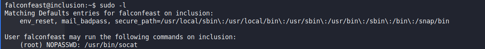

# Inclusion

[TryHackMe Inclusion](https://tryhackme.com/room/inclusion)

Running nmap scans

`nmap -sC -sV -oN nmap/initial <IP>`

```
22/tcp open  ssh     OpenSSH 7.6p1 Ubuntu 4ubuntu0.3 (Ubuntu Linux; protocol 2.0)
| ssh-hostkey: 
|   2048 e6:3a:2e:37:2b:35:fb:47:ca:90:30:d2:14:1c:6c:50 (RSA)
|   256 73:1d:17:93:80:31:4f:8a:d5:71:cb:ba:70:63:38:04 (ECDSA)
|_  256 d3:52:31:e8:78:1b:a6:84:db:9b:23:86:f0:1f:31:2a (ED25519)
80/tcp open  http    Werkzeug httpd 0.16.0 (Python 3.6.9)
|_http-server-header: Werkzeug/0.16.0 Python/3.6.9
|_http-title: My blog
Service Info: OS: Linux; CPE: cpe:/o:linux:linux_kernel
```

```
acessing the web page nothing seems juicy in home page then I went through articles I found 
```


```
A perfect place to try LFI so I started moving directories backward till I found /etc/passwd
```


```
Here I could see a user falconfeast with his password
```


```
Then I ssh into the machine using the username and password and I was able to find user.txt which contained flag. Now we had to esclate privileges to read the root flag
```


```
listing all the files
```


```
Now on running sudo -l I found that we could run socat without the password
```


```
On researching for some time I found the below link to esclate privileges through socat
```
[GTFOBins](https://gtfobins.github.io/gtfobins/socat/)

```
on running the given command I was root
```


```
cat /root/root.txt for root flag
```


